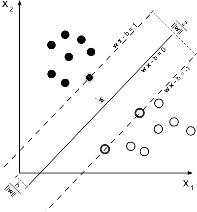

## Max Margin SVM

## Hard Margin SVM

  - Look at top support vector, ignore bias for a second 

$$\mathbf{w} \cdot \vec{x} = 1$$

$$\frac{m}{2} = \frac{\mathbf{w}}{||\mathbf{w}||} \cdot \vec{x} = \frac{1}{||\mathbf{w}||}$$

$$m = \frac{2}{||\mathbf{w}||}$$

  - Objective is to minimize _||w||_ subject to the equation below

$$\mathbf{w} \cdot \vec{x_i} \ge 1, y_i = 1$$
$$\mathbf{w} \cdot \vec{x_i} \le -1, y_i = -1$$
$$y(\mathbf{w} \cdot \vec{x_i}) \ge 1, 1 \le i \le n$$

## Soft Margin SVM

  - Soft margin introduced for data that isnt linearly separable

$$max(0, 1 - y_i(\mathbf{w} \vec{x_i}))$$

  - Even if label and prediction agree, if the agreement is less than 1, some loss!
    - This is penalizing data in the margin!

  - Now minimize

$$ \frac{\lambda}{2} ||\mathbf{w}||^2 + \frac{1}{N}\sum_{i=1}^{N} max(0, 1 - y_i(\mathbf{w} \vec{x_i}))$$

  - Shares exactly the same form as our regularized average loss framework!

$$ \frac{\lambda}{2} ||\mathbf{w}||^2 + \frac{1}{N}\sum_{i=1}^{N} Q(y_i, f(x_i))$$

## Soft Margin SVM vs Perceptron

  - Margin is the difference between Linear soft-margin SVM and Perceptron
    - SVM doesnt penalize data outside the margins
    - Margin is important for generalization

$$max(0, 1 - y_i(\mathbf{w} \vec{x_i}))$$

  - Perceptron doesnt penalize as long as its on the right side of the line!
    - Poor generalizer due to weak constraints

$$max(0,  -y_i(\mathbf{w} \vec{x_i}))$$

## Logistic Loss

$$\mathbf{P_{\theta}}(y_t|x_t) = \frac{1}{1 + e^{-f_{\theta}(x)}}, y_t = 1$$
$$\mathbf{P_{\theta}}(y_t|x_t) = 1 - \frac{1}{1 + e^{-f_{\theta}(x)}}, y_t = -1$$

  - Sigmoid guarantees output between 0, 1
  
  - Rewrite as:

$$\mathbf{P_{\theta}}(y_t|x_t) = \frac{1}{1 + e^{-y_t f_{\theta}(x)}}, y_t = 1$$

  - Now log likelihood
  
$$\log \mathcal{L}(\theta) = - \sum_{t=1}^{N} \log(1 + e^{-y_t f_{\theta}(x)})$$
  
  - We wish to minimize the negative log likelihood, leaving *_Q_* as:

$$\log(1 + e^{-y_t f_{\theta}(x)})$$

## Gradient-based Empirical Risk Minimization

  - Taylor series of the empirical risk at current parameters $\theta_t$

$$R_L(f_{\theta}) = R_L(f_{\theta_t}) + (\theta - \theta_t) \cdot \frac{\partial R_L(f_{\theta_t})}{\partial \theta} + (\theta - \theta_t)^T \frac{\partial^2 R_L(f_{\theta_t})}{\partial \theta^2}(\theta - \theta_t)...$$

  - First order uses only first derivative
    - Best approximation we can do is
    
$$\theta_{t+1} \gets \theta_t - \eta_t \frac{\partial R_L(f_{\theta_t})}{\partial \theta}$$
