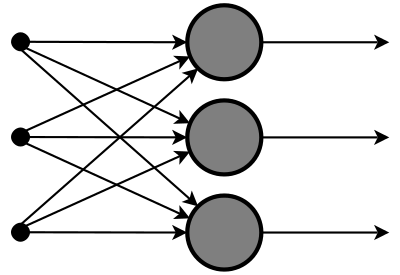
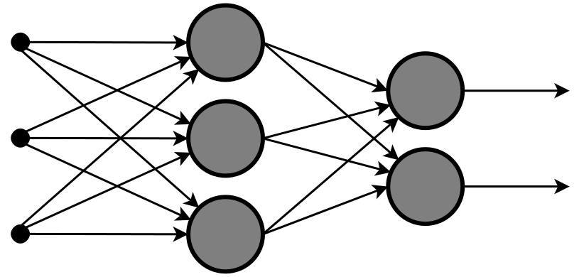
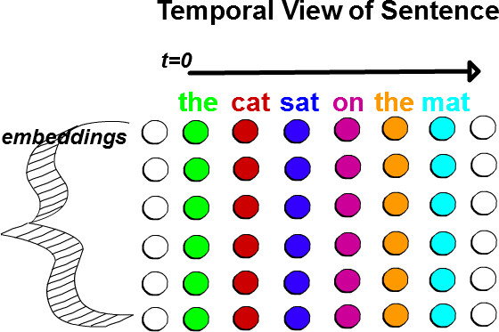
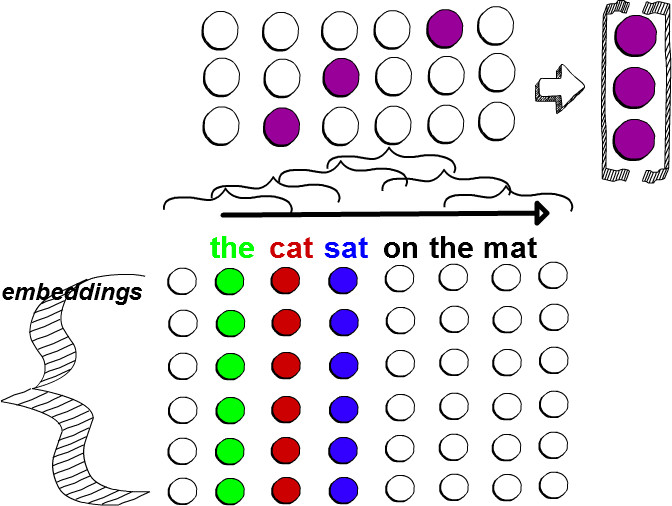
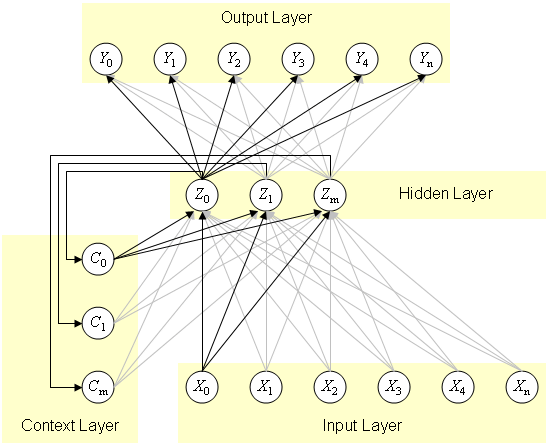
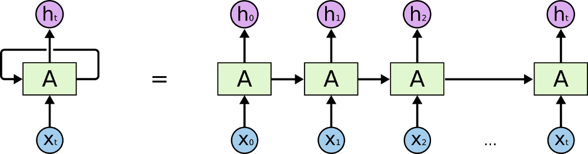
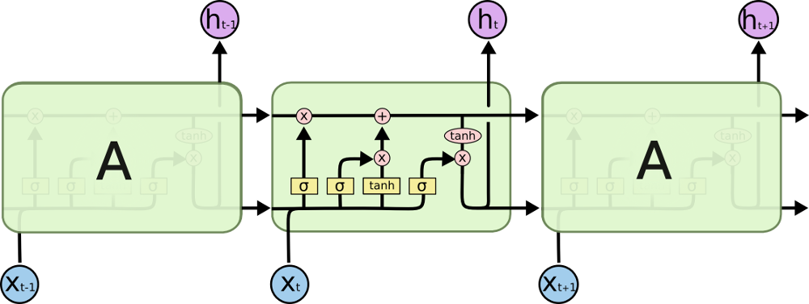
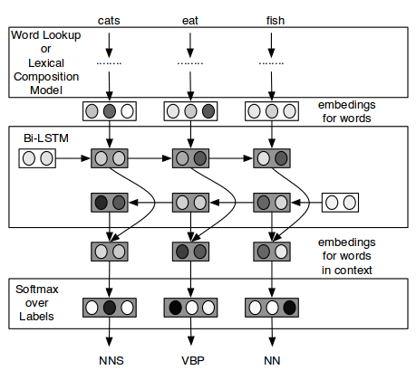

## Announcements

  - Starting preparation for a2-dlearn 2016
    - Looking for speakers, especially outside of NLP!
  - We are going to do a Deep Learning Fair this year
    - Want to participate?
    
## About This Talk

  - Extend what we did last time to deep neural nets
    - Relies a bit on the last talk, otherwise too much to cover
    
  - Still too much for two sessions, way too much material
    - If interested, see references, lots of great material from others
    - Wanted to talk about computation graphs, but no time, good refs. included
  
  - Every one will have different knowledge, difficult to make all happy
    - Some math, try to keep it minimal
    - Some code as a guide for navigating subject matter, mostly Torch/Lua this time
    
  - Not a diagram guy, borrowed most images (except a few)
    - You can find all original sources at the end


## Summary of Last Session

  - Optimization framework with loss functions for shallow models
    - Model
    - Data, feature vectors
    - Learning through SGD with chain rule
    - Loss functions (hinge, log loss, square)
  - Sparse optimizations
  - Feature hashing
  - Application of word embeddings for linear BoW models
  - Large dataset handling
  - NBSVM - A discriminative AND generative linear BoW model
  - Slides online, and backups explaining details of particular losses

## Highlights

- Empirical risk minimization
  
  $$R_L: f \in \mathcal{F} \longmapsto E_N(f) = \frac{1}{N} \sum_{n=0}^{N} Q(z_n, f)$$

- Performed with stochastic gradient descent 

 $$w^{(t+1)} = w^{(t)} - \eta \nabla Q(y_t, f(x_t))$$

## Review: Concrete example with L2 loss:

  - Loss function
  $$Q = \frac{1}{2} (f_w(x) - y)^2$$
  - Derivative of loss with respect to params (chain rule)
  $$(f_w(x) - y) \frac{\partial}{\partial w_j}(f_w(x) - y)$$
  $$(f_w(x) - y) \frac{\partial}{\partial w_j} \sum_{d=0}^{D} w_d x_d - y$$
- Finally wrt parameter _j_, we get a simple update
  $$(f_w(x) - y) x_j$$

- Use chain rule to make cost derivative modular
  - Note that first part of function is just the derivative of loss function WRT *_f(x)_*

## Multinomial Logistic Regression
  - Multinomial logistic regression yields a probability distribution over labels

    - Generalization of Logistic Regression to multi-class
    - Highly convenient for our purposes
    
    - Can be thought of as a linear application of weights, followed by a softmax
    $$P(Y=i|x,W,b) = softmax_i(Wx + b) = \frac{e^{W_i x + b_i}}{\sum_{j=1}^{C} e^{W_j x + b_j}}$$
 - Building a model in Torch
```
local model = nn.Sequential()
model:add(nn.Linear(xsz, nlabels))
model:add(nn.LogSoftMax())
...
-- Evaluate the model over FV x
local pred = model:forward(x)
```
## Cross-Entropy Loss Function

  - We often use cross entropy loss AKA negative log likelihood
  
   $$z = W x$$
   $$f(x) = softmax_i(z)$$
  - Cross entropy definition:
   $$Q = \frac{1}{D} \sum_{n=1}^{D} \mathbf{H}(p_n, q_n)$$
   $$\mathcal{l}(f(x), y) = \mathbf{H}(y, f(x)) = -\sum_{c=1}^{C} y_c log f(x)_c$$
   $$\mathcal{l}(f(x), y) = -\sum_{c=1}^{C} \mathbf{1}_{(y=c)} log f(x)_c$$
   $$= -log f(x)_{y}$$

## Gradient of Cross-Entropy Loss
  - Gradient turns out to be simple, though getting there takes some work
    - https://www.youtube.com/watch?v=1N837i4s1T8
    - Also in Bishop book  
    
   $$= -1 (\mathbf{1}{(y=c)} - f(x)_c)$$
   $$= -1 (actuals - predicted)$$
  - Code in Torch for evaluating
```
-- Use NLL since our model has LogSoftMax otherwise use nn.CrossEntropyCriterion()
local crit = nn.ClassNLLCriterion()
...
-- Evaluate model for FV x
local pred = model:forward(x)
-- Forward computes the loss
local err = crit:forward(pred, y)
-- Gradient
local grad = crit:backward(pred, y)
```

## Multinomial Logistic Regression Graph



## Multi-Layer Perceptron Graph



## Forward prop in Multi-layer Perceptron

  - Preactivations
   $$z^{(l+1)} = W^{(l)} h^{(l)} + b^{(l)}$$

  - Activations ($f^{(l)}$ is a tanh or sigmoid usually)
   $$h^{(l)} = f^{(l)}(z^{(l)})$$

  - Inputs
   $$h^{(0)} = x$$
   
  - Outputs
   $$y = h^{(L)}$$

 - If we use our softmax for final layer
   $$f^{(L)} = softmax$$

## Backprop in Multi-layer perceptron

  - Updating the pre-activations

$$\frac{\partial E}{\partial z^{(l)}_{j}} = \frac{\partial E}{\partial h^{(l)}_{j}} \frac{\partial h^{(l)}_{j}}{\partial z^{(l)}_{j}} = \frac{\partial E}{\partial h^{(l)}_{j}} f'(z^{(l)}_{j})$$
  - Updating activations (final state)
  $$\frac{\partial E}{\partial h^{(L)}_{i}} = \frac{\partial E}{\partial y_{i}} = -1 (\mathbf{1}_{(y=c)} - f(x)_c)$$
  
  - Updating activations (non-final)
  $$\frac{\partial E}{\partial h^{(l)}_{i}} = \sum \frac{\partial E}{\partial z^{(l+1)}_{j}} \frac{\partial z^{(l+1)}_{j}}{\partial h^{(l)}_{i}} = \sum \frac{\partial E}{\partial z^{(l+1)}_{j}} w_{ij}$$

 
## Multi-layer perceptron (backward propagation)

  - Updating the weights
 
  $$\frac{\partial E}{\partial w^{(l)}_{ij}} = \frac{\partial E}{\partial z^{(l+1)}_{j}} \frac{\partial z^{(l+1)}_{j}} {\partial w^{(l)}_{ij}} = \frac{\partial E}{\partial z^{(l+1)}_{j}} h^{(l)}_{i}$$

  - We can define a layers producing activations or pre-activations
    - Can define a activation and weight gradients only in terms of next step and forward input to layer
    - forward function to get us through the layer to our outputs
    - backward function to propagate using chain rule to our inputs

## Pattern of backprop

 - We saw forward() and backward() functions already.  Here is the chain rule at work

```
function Sequential:backward(input, gradOutput, scale)
  scale = scale or 1
  local currentGradOutput = gradOutput
  local currentModule = self.modules[#self.modules]
  for i=#self.modules-1,1,-1 do
    local previousModule = self.modules[i]
    currentGradOutput = self:rethrowErrors(currentModule, i+1, 'backward', previousModule.output,
        currentGradOutput, scale)
    currentModule.gradInput = currentGradOutput
    currentModule = previousModule
  end
  currentGradOutput = self:rethrowErrors(currentModule, 1, 'backward', input, currentGradOutput, scale)
  self.gradInput = currentGradOutput
  return currentGradOutput
end
```
## Mini-batch optimization: utilize parallel computation

 $$w^{(t+1)} = w^{(t)} - \eta \frac{1}{B} \sum_{b=Bt + 1}^{B(t+1)} \frac{\partial L(z, \theta)}{\partial \theta}$$

 - Bengio: When B increases, more multiply-add operations per second by taking advantage of parallelism or efficient matrix-matrix multipli-
cations (instead of separate matrix-vector multiplications),
    - Often gaining a factor of 2 in practice in overall training time. 
    - However, as B increases, number of updates per computation done decreases, convergence slows
  - Need to tweak learning rate hyper-params when we do this
 
## Problem motivation

  - We spend hours doing feature engineering, hopefully with good results
    - Live or die by good feature engineering, clever NLPers
    - Some kitchen-sink action as well

  - What if we could avoid this and let the machine figure it out!
    - Goal of deep learning, system learns to extract its own features
    - Feature maps

## CONLL2000 POS chunker

```
# Unigram
U00:%x[-2,0]
U01:%x[-1,0]
U02:%x[0,0]
U03:%x[1,0]
U04:%x[2,0]
U05:%x[-1,0]/%x[0,0]
U06:%x[0,0]/%x[1,0]

U10:%x[-2,1]
U11:%x[-1,1]
U12:%x[0,1]
U13:%x[1,1]
U14:%x[2,1]
U15:%x[-2,1]/%x[-1,1]
U16:%x[-1,1]/%x[0,1]
U17:%x[0,1]/%x[1,1]
U18:%x[1,1]/%x[2,1]

U20:%x[-2,1]/%x[-1,1]/%x[0,1]
U21:%x[-1,1]/%x[0,1]/%x[1,1]
U22:%x[0,1]/%x[1,1]/%x[2,1]

# Bigram
B
```
## Partial Snippet of Features for Dep. Parsing

```     
        heads = dict((arc[1], arc[0]) for arc in conf.arcs)
        ...
        # Features from the stack
        if len(conf.stack) > 0:
        s0_pos = conf.stack[-1]
        if s0_pos < len(sentence):
            s0w = sentence[s0_pos][WORD]
            s0p = sentence[s0_pos][POS]
        else:
            s0w = "ROOT"
            s0p = "ROOT"

        if len(conf.stack) > 1:
            s1_pos = conf.stack[-2]
            s1w = sentence[s1_pos][WORD]
            s1p = sentence[s1_pos][POS]

        hc = head_children(conf.arcs, s0_pos, sentence)
        left_most = hc[0]
        s10p = left_most[POS]
        right_most = hc[1]
        sr0p = right_most[POS]

        sh0p = "NULL"
        if s0_pos in heads:
            sh0p = sentence[heads[s0_pos]][POS]

```

## BoW Revisited
  - A lot of times, we use (shingled) Bag of Words models
    - Sentiment analysis
    - Text categorization

  - Looked at NBSVM last time, elegant idea, good performance, shingled BoW

  - We can often use an MLP as a drop in for a shallow model
    - This is often called an Neural BoW

## BoW is not NLP at its Best

  - BoW models seem deeply flawed!  Don't seem to model how humans process text
    - They dont preserve or utilize structure or time

  - Our text is deeply structured
    - Articles <- Sections <- Paragraphs <- Sentences <- Words
  - At a bare minimum, most NLP seems like interpreting words (or even characters) over time
    - Tagging is temporal where a label predicted for each word
    - Language modeling is temporal where a new word is predicted at each state
    - Classification, reading a post, producing a label

  - Can we do better?
    
## NLP as Temporal Problem



## NLP as Temporal Problem
  - So is it a signal processing problem?
  - Convolution: identifies, preserves locally important features
    - Can be stacked building a hierarchy of features
    - Key for image recognition, invariant to rotation, scaling, shares weights
    - Takes into account ngrams, but learns to handle them dynamically, can preserve word orders
  - Kalchbrenner: Trained weights in filter correspond to a linguistic feature detector
    - Learns to recognize a specific class of n-grams
  - Collobert: Tagging a word considers the whole sentence
    - Produces local features around each word of the sentence, combine into a global feature vector fed to standard layers

## Application of a 1D Conv Layer
```
-- This is just to demonstrate how it works, normally use TemporalConvolution
-- Our signal, T words, each with depth kL
local sig = torch.Tensor(T, kL):normal()
convlen = sig:size(1) - kW+1
-- The internal representation of weights (wgt) is a cube: nK x kL x kW
-- Note this is slightly different from TemporalConvolution banding
local output = torch.zeros(convlen, nK)
-- each output feature map
for k=1,nK do 
    for i=1,convlen do
        output[{i,k}] = tconv.bias[k] -- set bias in output
    end
    -- each input feature map of k: wgt[k][l]
    for l=1,kL do -- each 
        local line = sig[{{},l}] -- full signal for lth input feature map
        for i=1,convlen do -- each lag
            local elem = line:sub(i, i+kW-1) -- valid region only
            output[{i,k}] = output[{i,k}] + elem:dot(wgt[{k,{},l}])
        end
    end
end
```

## Simple Convolution/Max-Over-Time (CMOT) Architecture

  - Here is a simple CNN that works very well on short texts
    - Convolutional layer generating between 60 and 500 feature maps, followed by non-linearity
    - Max over time pooling generating a hidden output of same size as # feature maps
    - Linear layer to number of classes
    - Softmax output

  - Use word2vec embeddings as pretraining for a Lookup Table
    - A lookup table is a multiply of 1-hot vector against shared weight matrix, yielding a single column
    - We have an array of temporal 1-hot vectors to convert
    - We can initialize our weights with word2vec model

  - For very sparse data, or when morphology important, use character level embeddings
    - Here just use word2vec on char-split data, average together for a word

## CMOT Model



## CMOT Model (Torch)

```
function createModel(lookupTable, hsz, filtsz, gpu, nc)
    local dsz = lookupTable.dsz
    local seq = nn.Sequential()
    seq:add(lookupTable)
    seq:add(nn.TemporalConvolution(dsz, hsz, filtsz))
    seq:add(nn.ReLU())
    seq:add(nn.Max(2))
    seq:add(nn.Dropout(0.5))
    seq:add(nn.Linear(hsz, nc))
    seq:add(nn.LogSoftMax())
    return gpu and seq:cuda() or seq
end
...
local w2v = Word2VecLookupTable(opt.embed, vocab)
local f2i = {}
ts,f2i = loadTemporalIndices(opt.train, w2v, f2i, opt)
es,f2i = loadTemporalIndices(opt.eval, w2v, f2i, opt)
local i2f = revlut(f2i)
local model = createModel(w2v, opt.hsz, opt.filtsz, opt.gpu, #i2f)
```

## SGD Variants Using Optim
```
w,dEdw = model:getParameters()
      
local si = shuffle[i]
local x = options.gpu and xt[si]:cuda() or xt[si]
local y = options.gpu and yt[si]:cuda() or yt[si]
local thisBatchSz = x:size(1)

local evalf = function(wt)

  if wt ~= w then w:copy(wt) end
  -- zero weight grads  
  dEdw:zero()

  local pred = model:forward(x)
  local err = crit:forward(pred, y)
  ...
  -- backprop
  local grad = crit:backward(pred, y)
  model:backward(x, grad)
  -- Return error weights to optimizer
  return err, dEdw
end

optmeth(evalf, w, state) -- e.g. optim.adagrad
```

## Even Simpler CMOT Algorithm

  - Many times we can just avoid "fine-tuning" and read training data in as embedding vectors
    - Off-the-shelf can work very well

  - When fixing weights, don't bother using a LookupTable, its slow and unneeded
   - Just load feature vectors of dense embeddings (very cheap)
   - We covered preloading vectors last time for shallow classifiers

## CMOT Model with Fixed Weights (Torch)

```
function createModel(dsz, hsz, filtsz, gpu, nc)
    local seq = nn.Sequential()
    seq:add(nn.TemporalConvolution(dsz, hsz, filtsz))
    seq:add(nn.ReLU())
    seq:add(nn.Max(2))
    seq:add(nn.Dropout(0.5))
    seq:add(nn.Linear(hsz, nc))
    seq:add(nn.LogSoftMax())
    return gpu and seq:cuda() or seq
end
```

## Setting up the model
Load models, not layers
```
local w2v = Word2VecModel(opt.embed)
local dsz = w2v.dsz
if opt.cembed ~= 'none' then
   opt.w2cv = Word2VecModel(opt.cembed)
   dsz = dsz + opt.w2cv.dsz
end
```
Now use to make features
```
local y = torch.Tensor({f2i[label]})
local toks = text:split(' ')
local mx = math.min(#toks, mxlen)
local siglen = mx + (2*halffiltsz)
local x = torch.zeros(siglen, dsz)
for i=1,mx do
  local w = toks[i]
  local z = w2v:lookup(w)
  if options.w2cv then
    local q = word2chvec(options.w2cv, w)
    z = torch.cat(z, q)
  end
  x[{i + halffiltsz}] = z
end
```

## Other Viewpoints

  - Maybe we should think of NLP as a combination of temporal signal and memory
    - Read words, remember context (short term memory buffer) 
    - Implies a Recurrent Neural Network
  - This is prevalent approach for language modeling with DNNs
    - Also commonly applied to other problems: tagging, parsing, everything?

## "Vanilla" RNN (Elman Network)



## Unrolling an RNN



 - One for each timestep, shared weights
   - Image from http://colah.github.io/posts/2015-08-Understanding-LSTMs
 - Problem due to vanishing/exploding gradients
   - Graves: Sensitivity decays over time as new inputs overwrite activations of hidden layer and network 'forgets' first inputs

## In Practice: LSTM (Unrolled)




## LSTM Cell (No Peephole Connections)

$$i_t = \sigma( W_{x,i} x_t + W_{h,i} h_{t-1} + b_i)$$
$$f_t = \sigma( W_{x,f} x_t + W_{h,f} h_{t-1} + b_f)$$
$$z_t = tanh( W_{x,c} x_t + W_{h,c} h_{t-1} + b_c)$$
$$c_t = f_t \cdot c_{t-1} + i_t \cdot z_t$$
$$o_t = \sigma( W_{x,o} x_t + W_{h,o} h_{t-1} + b_o)$$
$$h_t = o_t \cdot tanh(c_t)$$

## BLSTMs for tagging (Ling et al. 2015)



## Characters and Morphology

  - Characters and Morphology important for most tagging tasks
    - Collobert used separate handcrafted features for this
    - dos Santos improves on Collobert model using character compositions learned using CMOT architecture
  - Would we get an improvement just by averaging char vectors? (obviously wouldnt likely be as good, but quick and dirty)
    - Seems to be a yes, slight improvement on Twitter POS!
    - Keep it simple for these examples
    - Code is very similar to what was shown for CMOT

## Model
```
    -- Make two RNN units, one for forward direction, one for backward
	  local tsz = 2 * hsz
	  local rnnfwd = nn.LSTM(dsz, hsz)
	  local rnnbwd = nn.LSTM(dsz, hsz)
	  
	  -- This will feed the same input, and will join
	  -- results along the 3rd dimension
	  local concat = nn.Concat(3)
	  concat:add(rnnfwd)
	  
	  -- Create a sub-chain for reverse
	  local subseq = nn.Sequential()
	  
	  -- Flip the signal so time is descending
	  subseq:add(nn.ReversedCopy())
	  subseq:add(rnnbwd)
	  
	  -- Flip the signal again when done
	  subseq:add(nn.ReversedCopy())
	  concat:add(subseq)
	  seq:add(concat)
    seq:add(nn.Dropout(0.5))
    seq:add(nn.TemporalConvolution(tsz, nc, 1))
```

## References - 1
  - Full unabbreviated code
    - https://github.com/dpressel/baseline
    - https://github.com/dpressel/sgdtk
  - Practical Recommendations for Gradient-Based Training of Deep Architectures - Bengio
    - http://arxiv.org/pdf/1206.5533v2.pdf
  - Andrew Gibiansky (Blog)
    - http://andrew.gibiansky.com/blog/machine-learning/fully-connected-neural-networks/
  - Hugo Larochelle (Watch every single one!)
    - https://www.youtube.com/watch?v=_KoWTD8T45Q
  - Neural Architectures for Named Entity Recognition - Lample, Ballesteros, Subramanian, Kawakami, Dyer
    - http://arxiv.org/pdf/1603.01360v1.pdf
  - Finding Function in Form: Compositional Character Models for Open Vocabulary Word Representation - Ling et. al.
    - http://www.cs.cmu.edu/~lingwang/papers/emnlp2015.pdf
    - https://github.com/wlin12/JNN
 
## References - 2

  - Tutorial on Logistic Regression in Theano (other good ones too!)
    - http://deeplearning.net/tutorial/logreg.html
  - http://stats.stackexchange.com/questions/140811/how-large-should-the-batch-size-be-for-stochastic-gradient-descent?rq=1
  - Convolutional Neural Networks for Sentence Classification - Kim (2015)
    - http://arxiv.org/pdf/1408.5882v2.pdf
  - Natural Language Processing (Almost) from Scratch - Collobert et. al.
    - http://jmlr.org/papers/volume12/collobert11a/collobert11a.pdf
  - A Convolutional Neural Network for Modelling Sentences - Kalchbrenner, Grefenstette, Blunsom
    - http://arxiv.org/pdf/1404.2188v1.pdf
  - Boosting Named Entity Recognition with Neural Character Embeddings - dos Santos, Guimaraes
    - http://www.aclweb.org/anthology/W15-3904
  - Learning Character-level Representations for Part-of-Speech Tagging - dos Santos, Zadrozny
    - http://jmlr.csail.mit.edu/proceedings/papers/v32/santos14.pdf
  - Summary of dos Santos models
    - https://rawgit.com/dpressel/Meetups/master/nlp-reading-group-2016-03-14/presentation.html
  
## References - 3

- Torch RNN module
    - https://github.com/Element-Research/rnn
  - Justin Johnson's torch-rnn code
    - https://github.com/jcjohnson/torch-rnn
  - http://mnemstudio.org/neural-networks-elman.htm
  - http://colah.github.io/posts/2015-08-Understanding-LSTMs/
  - Supervised Sequence Labelling with Recurrent Neural Networks - Graves
    - https://www.cs.toronto.edu/~graves/preprint.pdf
  - http://blog.aidangomez.ca/2016/04/17/Backpropogating-an-LSTM-A-Numerical-Example/
  - Microsoft CNTK Book - Nice Computational Network Section
    - http://research.microsoft.com/pubs/226641/CNTKBook-20160217..pdf
  - Theano manual Graph section
    - http://deeplearning.net/software/theano/extending/graphstructures.html
  - Presentation discussing implementing convolution in time and frequency domain (in C++ and R)
    - https://cdn.rawgit.com/AnnArborRUserGroup/Presentations/master/2015-11/rjava-rcpp/presentation.html#1