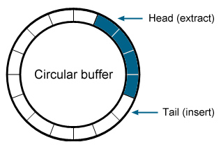

## Overview (Part I)
  - Background
  - Classification/Regression as Empirical Risk Minimization framework with
    - Loss functions
    - Stochastic Gradient Descent (SGD)
    - Learning Rate Decay
    - Out-of-core processing
    - Feature Hashing/Word Embeddings
    - Optimizations for sparse features

  - NLP Example: SVM with Generative Features

## Overview (Part II)
  
  - Refitting our framework for deep learning
    - More on Dense Representations
    - Multiclass learning
  - Fully Connected Layers
  - Convolutional Layers
  - Max Over Time, K-Max
  - Language Choices
  - On GPUs


## Background (Part I)

  - What if we want to process BIG datasets
    - Sets might not fit in memory
    - Often, for NLP, with classifiers like logistic regression and linear SVMs

  - Want to do it efficiently
    - Dont load whole batch into memory
  
  - Desire a learning approach that is not bottlenecked by the training set size 
  
  - Additionally remember that in NLP, tend to have lots of sparse features
    - Would like to optimize as well for this

## Sources

  - This talk borrows most of its content from work of 
    - Leon Bottou - researcher, SGD evangelist, author of sgd demo code
    - Ronan Collobert - Bottou's PhD student, creator of Torch
    - Yann LeCun - head of FAIR, researcher, creator of LeNet5
    - John Langford - researcher at MS Research, author of Vowpal Wabbit
    
  - These guys have done enough individually that it would take the whole slideshow just to list!
  
## Some Basic Definitions - Machine Learning

  - What is Machine Learning?
    - Me: _"Learn from training data to predict unknown outcomes given input parameters"_
    
    - Ronan Collobert: _"Machine Learning aims to minimize the expected risk (generalization error) using only the information of the training set"_
      - _"We are seeking a function f in a set of functions F which minimizes the cost function *Q* over *Z*"_
      $$R: f \in \mathcal{F} \longmapsto E(Q(z,f)) = \int_Z Q(z, f) P(z) dz$$

    - But, cannot simply minimize with optimization, as distribution *_P_* is unknown -- instead minimize empirical risk (average loss) over training set
  
      $$R_L: f \in \mathcal{F} \longmapsto E_N(f) = \frac{1}{N} \sum_{n=0}^{N} Q(z_n, f)$$

  - As training data increases, empirical risk converges to expected risk!
    - Weak law of large numbers!

## Some Basic Definitions - Data

  - Feature Vector?  *_x_*
    - Chosen parameters to the function we are building, a fixed vector of dimension _D_

  - Label/predicted value  *_f(x)_*
    - What we want to predict
      - Continous predictors are regression models, discrete are classifiers
      - During training, known labels seen with features, so that we can learn

  - Training example
  $$z_i = (x_i, y_i) \in X \times Y$$

  - Training data, of length *_N_*:
  $$\{z_1, z_2, ..., z_N\}$$
  
  - Loss function
    - Price paid for inaccuracy of predictions
  $$Q(z_n, f)$$

## More about loss functions

- Our Risk Minimization Framework requires us to define a cost or loss function *_Q_*
  
  - Square (L2) _Common for linear regression_
  $$[f(x) - y]^2$$
      
  - Log (Logistic) _Common for classification_
  $$log(1 + e^{-yf(x)})$$
      
  - Hinge (SVM with slack) _Common for classification_
    - Even though this is non-differentiable at 0, can use sub-gradient!
  $$max(0, 1 - y f(x))$$
    

## So how do we learn it?

- One simple way, works on almost all functions is Gradient Descent
  - Randomly guess starting point
  - Iterative
    - Take steps proportional to negative of gradient of the function at the current point

$$w^{(i+1)} = w^{(i)} - \eta \nabla Q(y, f(x))$$
$$w^{(i+1)} = w^{(i)} - \eta \sum_{n=1}^{N} \nabla Q(y_n, f(x))$$

$$w_j^{(i+1)} = w_j^{(i)} - \eta \sum_{n=1}^{N} \frac{\partial{Q}}{\partial{f(x)}}\frac{\partial{f(x)}}{\partial w_j^{(i)}} Q(y_n, f(x))$$

## Stochastic Gradient Descent

  - A problem with GD is that it must see the entire "batch" *_N_* before it makes a parameter update
    - This means that its a function of *_N_* and of *_D_* for a parameter update
      - Learning scales with size of dataset!

  - What if instead of updating per batch, we updated per training example?
    - Approximate gradient with single random example
    - Parameter update is a function of *_D_* now only.
    - There could be local noise, which could throw off the approximation
    - In practice, works extremely well, tends to learn more stuff faster

  $$w^{(t+1)} = w^{(t)} - \eta \nabla Q(y_t, f(x_t))$$

## Concrete example with L2 loss:

  - Loss function
  $$Q = \frac{1}{2} (f_w(x) - y)^2$$
  - Derivative of loss with respect to params (chain rule)
  $$(f_w(x) - y) \frac{\partial}{\partial w_j}(f_w(x) - y)$$
  $$(f_w(x) - y) \frac{\partial}{\partial w_j} \sum_{d=0}^{D} w_d x_d - y$$
- Finally wrt parameter _j_, we get a simple update
  $$(f_w(x) - y) x_j$$

- Use chain rule to make cost derivative modular
  - Note that first part of function is just the derivative of loss function WRT *_f(x)_*
  
## SGD with L2 regularization

$$E_n(w) = \frac{\lambda}{2} ||w||^2 + \frac{1}{N} \sum_{t=1}^{N} Q(y_t, f(x_t))$$

- Derivative

$$w^{(t+1)} = w^{(t)} - \eta_t \lambda w^{(t)} - \eta_t x_t \frac{\partial{Q}}{\partial{f(x)}} Q(y_t, f(x_t))$$

- Reduces to

$$w^{(t+1)} = (1 - \eta_t \lambda) w^{(t)} - \eta_t x_t \frac{\partial{Q}}{\partial{f(x)}} Q(y_t, f(x_t))$$

## Code for Loss function

```{c eval=FALSE}
public class SquaredLoss implements Loss
{
    @Override
    public double loss(double p, double y)
    {
        double d = p - y;
        return 0.5 * d * d;
    }

    @Override
    public double dLoss(double p, double y)
    {
        return (p - y);
    }
}
```

## Code for Hinge Loss function
```{c eval=FALSE}
public class HingeLoss implements Loss
{
    @Override
    public double loss(double p, double y)
    {
        return Math.max(0, 1 - p * y);
    }

    @Override
    public double dLoss(double p, double y)
    {
        return (Math.max(0, 1 - p * y) == 0) ? 0 : -y;
    }
}
```

## Code for SGD

```{c eval=FALSE}
/**
 *  Do simple stochastic gradient descent update step
 *  @param vectorN Feature vector
 *  @param eta Learning rate (step size)
 *  @param lambda regularization param
 *  @param dLoss loss WRT f(x): dLoss = lossFunction.dLoss(fx, y);
 */
public void updateWeights(VectorN vectorN, double eta, double lambda, double dLoss, double y)
{
    ArrayDouble x = ((DenseVectorN) vectorN).getX();
    weights.scale(1 - eta * lambda);
        
    for (int i = 0, sz = x.size(); i < sz; ++i)
    {
        weights.addi(i, -eta * dLoss * x.get(i));
    }
    wbias += -eta * BIAS_LR_SCALE * dLoss;
}
```

## Learning Rate Decay

  - We often want to slow down the learning rate over time.  This prevents overshooting as we get closer
    - step size too big: optimization diverges
    - step size too small: optimization slow, can get stuck in local minima

  - Progressive Decay
    - initial learning rate
    $$\eta = \eta_0$$
    - decay
    $$\eta_d$$
    - at each iteration _t_:
    $$\eta(t) = \frac{\eta0}{1 + t \eta_d}$$

## Example code with Robbins-Monro decay

```{c eval=FALSE}
public class RobbinsMonroUpdateSchedule implements LearningRateSchedule
{
    long numSeenTotal;
    double eta0;
    double lambda;

    @Override
    public void reset(double eta0, double lambda)
    {
        this.lambda = lambda;
        this.eta0 = eta0;
        numSeenTotal = 0;
    }
    
    @Override
    public double update()
    {
        double eta = eta0 / (1 + lambda * eta0 * numSeenTotal);
        ++numSeenTotal;
        return eta;
    }
```

## SGD Training on single example

```{c eval=FALSE}
/**
 * Binary trainer for single SGD example.  Update the
 * learning rate schedule, find derivative of loss WRT f(x),
 * pass to updateWeights() to make SGD update
 * @param model Our model
 * @param fv Our feature vector example with label and x vector
 */
public final void trainOne(Model model, FeatureVector fv)
{
    WeightModel weightModel = (WeightModel)model;
    double eta = learningRateSchedule.update();
    double y = fv.getY();
    double fx = weightModel.predict(fv);
    double dLoss = lossFunction.dLoss(fx, y);
    weightModel.updateWeights(fv.getX(), eta, lambda, dLoss, y);
}
```

## Memory efficient processing

  - Many machine learning libraries require the whole problem in working memory
  - With SGD, easy to avoid, undesirable since datasets large
  - Could read a line at a time from a file in sequence
    - But, File IO interrupts processing in single thread version
    - IO on large datasets with fast training algo becomes the processing bottleneck  
  - Use a fixed size circular buffer to feed SGD from memory, use another thread to feed that queue
    - Vowpal Wabbit uses this technique



## More Details on Circular Buffer Training Implementation

  - File IO thread
     - Reads the data from file
     - Inserts data to ring buffer
     - Also caches data to binary version of training set
     - Signals the processor thread at ends of epochs
     - Re-reads the data from cache on subsequent epochs

  - Processor (consumer) thread reads example from the circular buffer and trains with it
     - Ideally, callback at end of epoch

  - Relatively easy, but in practice, kind of painful to test

## A Few Details in Implementation in Java

  - Java has a nice ring buffer library called *Disruptor* - _very fast_
    - Lock free, low latency, prevent JVM GC stalls, memory allocation
    - > 5x gains over ArrayBlockingQueue in similar config
    - To utilize, we need to overload a class called EventHandler, and a MessageEvent

  - When we write the files out as a cache in Java, we can user RandomAccessFile to reload them
    - Very good performance
    - Also, random shuffling can be fast and simple
  - Java has an undocumented class called *Unsafe* that allows us native memory access
    - Way faster than serialization libraries (> 1000x)

## Disruptor-based Processor

```{c eval=FALSE}
// Assumes a class MessageEvent with a field FeatureVector fv
public class MessageEventHandler implements EventHandler<MessageEvent>
{
    /**
     * On a message, check if it is a null FV.  If so, we are at the end of an epoch.
     * @param messageEvent An FV holder
     * @param l Sequence number (which is increasing)
     * @param b not used
     * @throws Exception
     */
    @Override
    public void onEvent(MessageEvent messageEvent, long l, boolean b) throws Exception
    {
        if (messageEvent.fv == null)
        {
            onEpochEnded();
        }
        learner.trainOne(model, messageEvent.fv);
    }
```
## Publishing Feature Vectors for processing
```{c eval=FALSE}
public void start(Learner learner, Model model, int numEpochs, int bufferSize)
{
    this.numEpochs = numEpochs;
    executor = Executors.newSingleThreadExecutor();
    MessageEventFactory factory = new MessageEventFactory();
    WaitStrategy waitStrategy = (strategy == Strategy.YIELD) ? new YieldingWaitStrategy(): new BusySpinWaitStrategy();
    disruptor = 
        new Disruptor<MessageEvent>(factory, ExecUtils.nextPowerOf2(bufferSize), 
                                    executor, ProducerType.SINGLE, waitStrategy);
    handler = new MessageEventHandler(learner, model);
    disruptor.handleEventsWith(handler);
    disruptor.start();
}

@Override
public void add(FeatureVector fv)
{
    RingBuffer<MessageEvent> ringBuffer = disruptor.getRingBuffer();
    long sequence = ringBuffer.next();
    try
    {
        MessageEvent event = ringBuffer.get(sequence);
        event.fv = fv;
    }
    finally
    {
        ringBuffer.publish(sequence);
    }
}
```

## Dealing with fixed width feature vectors

  - Problem: during feature extraction, you extract millions of features with some string name
    - To build a feature vector, you need a Dictionary mapping strings to feature indices, dimension _D_
    - As your vocab gets larger, RAM usage increases with each word!
    - Also, if unlucky and using a bad implementation of a data structure, may be additional overhead to this
    - Sparse vector implementation also might help!
  - For memory efficiency and processing speed, don't allocate a new feature vector each time
    - Could grow vector as needed, but rather work with fixed width vectors

## Introducing Feature Hashing

  - In feature hashing, we dont build a Dictionary mapping feature name to index, we just hash it!
    - Pick a number of bits *_k_*
    - use a good hash function (e.g. Murmur hash), AND the output with (2^*_k_*)-1

  - Also this means that our feature vector itself is *_k_* bits as well
    - Can pre-allocate exactly the necessary number of bytes in our fixed buffer
    - John Langford: _"Online Learning + Hashing = learning algorithm with fully controlled memory footprint -> Robustness"_

## Feature Hashing Implementation

```{c eval=FALSE}
public class HashFeatureEncoder implements FeatureNameEncoder
{
    int space;

    /**
     * Default constructor, how many bits to use
     * @param nbits number bits to use
     */
    public HashFeatureEncoder(int nbits)
    {
        this.space = (int)Math.pow(2, nbits) - 1;
    }

    /**
     * Constant time lookup into space
     * @param name feature name
     * @return
     */
    @Override
    public Integer indexOf(String name)
    {
        return MurmurHash.hash32(name) & space;
    }
...
}

```

## Other Ways to Collapse Features?

  - Recently popular NLP approach - Continuous Representations
    - Convert "sparse one-hot" representation to "dense continuous" representation
    - For example, we can use pre-trained embeddings from word2vec or glove as input
    - A BoW document in continuous space is still a sum operation in continous space
    - YMMV without deeper learning

## Word2vec Embeddings Briefly

  - Word2vec maps a one hot vector to a continuous representation in embedded space
    - Train a shallow neural net (SGNS or CBOW)
    - Pop the base hidden layer connections out
    - Matrix of connections of size *_|V| x layerSz_*
    - Formula for lookup is then easy, but we have to keep Vocab LUT in memory again

## Getting the word2vec result

```{c eval=FALSE}

// LUT from literal word to its index in vectors
private final Map<String, Integer> vocab;

private final float[][] vectors; // |V| x layerSz

public float[] getVec(String word)
{
    if (vocab.containsKey(word))
    {
        return this.vectors[vocab.get(word)];
    }
    return this.NULLV;
}
```

## Building up Dense Feature Vectors

```{c eval=FALSE}
...
// Parse a sentence and place results in a continuous Bag of Words
DenseVectorN x = new DenseVectorN((int)embeddingSize);
ArrayDouble xArray = x.getX();

while (tokenizer.hasMoreTokens())
{
    // Optional, problem dependent
    String word = tokenizer.nextToken().toLowerCase();
    float[] wordVector = word2vecModel.getVec(word);
    for (int j = 0, sz = xArray.size(); j < sz; ++j)
    {
        // CBoW
        xArray.addi(j, wordVector[j]);
    }
}

final FeatureVector fv = new FeatureVector(label, x);
```

## Optimizations for Sparse Feature Vectors

- Remember from before, SGD with regularization:

$$w^{(t+1)} = (1 - \eta_t \lambda) w^{(t)} - \eta_t x_t \frac{\partial{Q}}{\partial{f(x)}} Q(y_t, f(x_t))$$

  - Bottou identifies a refactoring in SGD tricks that increase speed for sparse feature vectors
    - Complexity then scales with number of non-zero terms
$$w_t = s_t W_t$$
$$s_{t+1} = (1 - \eta_t \lambda) s_t$$
$$g_t = Q'(y_t, s_t W_t x_t)$$

$$\frac{(1 - \eta_t \lambda) s_t W_t}{(1 - \eta_t \lambda) s_t} - \frac{\eta_t x_t g_t}{s_{t+1}}$$ 

$$W_{t+1} = W_t - \eta_t g_t x_t/s_{t+1}$$


## Optimizations for Sparse Feature Vectors - Hogwild

  - Hogwild - Technique used by Word2vec code
    - Processors allowed equal access to shared memory and are able to update inidivual components of memory at will
    - When data is sparse, memory overwrites are rare and barely introduce any error in the computation when they do
    - Enables near-linear speedups

## Use Case: Online Learning in the Wild for NLP
  - Fascinating paper by Wang, Manning (2012)
    - SVM with generative features beats many approaches to Sentiment, Reviews and News categorization
    - Later found to be true with longer N-grams and LR (Mesnil, Mikolov, Bengio)
  - Think of feature vector activation in BoW model as attesting a feature with a value
    - Normally "one-hot"" sum
    - Can be other things, e.g., _tf-idf_ weight
    - But we can use more valuable weights!
    
## nbsvm Details
  
  - Remember Naive Bayes?
  
  $$p(C|D) \propto [\prod_{i=0}^{|V_D|} p(w_i|C)] p(C)$$

  - What if we use the likelihood ratio of components as features?
    - Simple to do, build a lexicon of feature counts over classes upfront
    - Calculate likelihood ratio of word in classes
    - When word is attested, apply weight as Feature value
    
  - We also will use a linear weighting between this SVM and NB (regularization)
    - Note that, with uniform priors, log likelihood sum is the NB probability of class

## nbsvm-xl Idea
  - Use everything we have learned to build large scale implementation
    - Feature hashing
    - LR/SVM
    - Fast out-of-core SGD (and optionally Adagrad) processing
    
  - Should be much faster than nbsvm, which uses liblinear, especially as dataset size increases

## nbsvm-xl Feature Weights

```{c eval=FALSE}
// Look up the generative feature
private void toFeature(Set<Integer> set, List<Offset> offsets, String... str)
{
    String joined = CollectionsManip.join(str, "_*_");
    int idx = hashFeatureEncoder.indexOf(joined);

    if (!set.contains(idx))
    {
        set.add(idx);
        Double v = lexicon.get(idx);
        offsets.add(new Offset(idx, v));
    }
}
```

## nbsvm-xl Lexicon extraction

```{c eval=FALSE}

// increment joins and hashes feature, as above, increments count in label specific ftable
for (int i = 0, sz = text.size(); i < sz; ++i)
{
    // Circular
    lll = ll;
    ll = l;
    l = t;
    t = text.get(i);
    // unigram
    increment(ftable, t);
    numTokens[labelIdx]++;
    // bigram?
    if (ngrams > 1 && l != null)
    {
        // trigram?
        increment(ftable, l, t);
        numTokens[labelIdx]++;
        if (ngrams > 2 && ll != null)
        {
            increment(ftable, ll, l, t);
            numTokens[labelIdx]++;
        }
        ...
    }
}
```

## nbsvm-xl Lexicon generation

```{c eval=FALSE}

double numTotalF0 = numTokens[0] + alpha * uniqueWordsF0;
double numTotalF1 = numTokens[1] + alpha * uniqueWordsF1;

for (Integer word : words)
{
    double f0 = (CollectionsManip.getOrDefault(ftable0, word, 0L) + alpha)/numTotalF0;
    double f1 = (CollectionsManip.getOrDefault(ftable1, word, 0L) + alpha)/numTotalF1;
    lexicon.put(word, Math.log(f1 / f0));
}
```

## Bakeoff (sorta)

  - Only 25k training examples available when using script provided by nbsvm
    - get these by running oh_my_gosh.sh from checkout of Mesnil's implementation
    - This is far from large, but still
  - Not good way of seeing real-time other than using _time_ command
  - My machine crushes data
     - Much faster than the estimates given by Mesnil

## nbsvm Performance (Trigrams)

```
dpressel@dpressel:~/dev/work/nbsvm_run$ time python ../nbsvm/nbsvm.py --liblinear liblinear-1.96 --ptrain data/train-pos.txt --ntrain data/train-neg.txt --ptest data/test-pos.txt --ntest data/test-neg.txt --ngram 123 --out NBSVM-TEST-TRIGRAM
counting...
computing r...
processing files...
iter  1 act 1.236e+04 pre 1.070e+04 delta 8.596e+00 f 1.733e+04 |g| 7.848e+03 CG   7
iter  2 act 3.132e+03 pre 2.542e+03 delta 1.033e+01 f 4.970e+03 |g| 2.126e+03 CG   9
iter  3 act 9.326e+02 pre 7.520e+02 delta 1.033e+01 f 1.838e+03 |g| 7.607e+02 CG   9
iter  4 act 2.631e+02 pre 2.130e+02 delta 1.033e+01 f 9.055e+02 |g| 2.825e+02 CG   8
iter  5 act 7.708e+01 pre 6.203e+01 delta 1.033e+01 f 6.424e+02 |g| 1.066e+02 CG   7
iter  6 act 3.909e+01 pre 3.054e+01 delta 1.033e+01 f 5.653e+02 |g| 4.129e+01 CG   9
Accuracy = 91.872% (22968/25000)

real	1m44.156s
user	1m43.172s
sys	0m1.280s
```

## nbsvm-xl Performance (Trigrams)
```
xl.nbsvm.NBSVM --train /home/dpressel/dev/work/nbsvm_run/data/train-xl.tsv --eval /home/dpressel/dev/work/nbsvm_run/data/test-xl.tsv 
--cgrams 0 --ngrams 3 --nbits 26 --loss log --epochs 10 -e0 0.05 --lambda 1e-6 --beta 1

4951537 hash words in lexicon, aggregated in 6.72s.  Starting training
Trained model in 18.81s.  25000 training examples seen
22969 / 25000
Model accuracy 91.88 %
Total hashing collisions 7065689
```

## nbsvm-xl Performance In General

  - This difference gets more stark with large datasets
    - Our out-of-core SGD remains incredibly consistent!
  - Previous attempt, last laptop million examples from Twitter
    - 1.5 minutes to build lexicon
    - 45s first epoch (due to overlap)
    - 15s for additional epochs
  
## References - 1
  - Ronan Collobert's Thesis
    - http://ronan.collobert.org/pub/matos/2004_phdthesis_lip6.pdf
  - Tradeoffs of Large-Scale Learning (Bottou, Bousquet)
    - http://leon.bottou.org/publications/pdf/nips-2007.pdf
  - SGD Tricks (Bottou)
    - http://research.microsoft.com/pubs/192769/tricks-2012.pdf
  - Large Scale Online Learning (Bottou/LeCun)
    - http://leon.bottou.org/publications/pdf/nips-2003.pdf
  - Hogwild
    - http://www.eecs.berkeley.edu/~brecht/papers/hogwildTR.pdf
  - Feature Hashing (Langford)
    - http://cilvr.cs.nyu.edu/diglib/lsml/lecture08-hashing.pdf
  - Intro to Stat. Machine Learning NNs - Samy Bengio
    - http://bengio.abracadoudou.com/lectures/old/tex_ann.pdf
## References - 2
  - Disruptor Performance (LMAX)
    - https://github.com/LMAX-Exchange/disruptor/wiki/Performance-Results
  - Unsafe IO vs Serialization (Thompson)
    - http://mechanical-sympathy.blogspot.com/2012/07/native-cc-like-performance-for-java.html
  - Reference code
    - https://github.com/dpressel/sgdtk
  - NBSVM Paper (Wang/Manning)
    - http://nlp.stanford.edu/pubs/sidaw12_simple_sentiment.pdf
  - Ensemble of Generative and Discriminative Techniques... (Mesnil)
    - http://arxiv.org/pdf/1412.5335v5.pdf
  - nbsvm baseline code
    - https://github.com/mesnilgr/nbsvm
  - nbsvm SGD reference code
    - https://github.com/dpressel/nbsvm-xl
  
