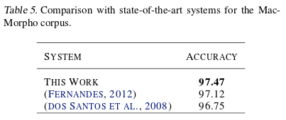

## About Distributed Representations

  - Proven important resource for NLP
    - In conjunction with DNNs, reduce need for handcrafted features

  - Usually learned using neural networks

  - Capture syntactic and semantic information about words
    - Information about morphology normally ignored
    - Trained discarding key character information that would be useful

## POS/NER Tagging with DNNs

  - For tasks like POS tagging, intra-word info is useful
      - Especially true for morphologically rich languages
      - Previous attempts for DNNs have included handcrafted shape features (Collobert 2011)

  - DNN with char level representations of words AND word representations to perform tagging
    - Idea here builds off that Collobert 2011 model, but truly is "From Scratch"
    - Actually idea inspired from footnotes in Collobert 2011

## Network Overview

  - Create DNN with
     - "Window approach" - fixed window fully connected deep network (Collobert 2011)
     - Sentence Log Likelihood Cost - structured prediction using transition weights (Collobert 2011)
     - Concatenate word and character features - word2vec + char embeddings with convolution and pooling 

  - Should work for all tagging applications, multiple languages
  - POS Paper
    - English (WSJ Section of PTB Corpus)
    - Portuguese (Mac Morpho Corpus)
  - NER Paper
    - Portuguese (Harem I Corpus)
    - Spanish (SPA CoNLL 2002 Corpus)

## Refresher on Window Approach

  - Fixed context window, centered on word to tag
    - Words first converted to vectors
  - Fully connected layer to hidden layer
  - Non-linearity
  - Fully connected layer outputs to number of output classes
    - 45 labels for English POS tagger, 22 for Portuguese
    - 10 for NER tagger (5 for "selective")
  
## Window Approach (Collobert 2011)

## How to incorporate characters?

  - Handcrafted features, limited, undesirable
  - Want to take into account most important information into fixed vector for a word
    - Feature extraction with Convolutional Nets
    - Tracks closely with Collobert 2011's Sentence Approach for global coherency!

## Character Level Feature Vector for Words

  - Get varying number of chars into fixed representation for a single word
    - First, convert to continuous char representations
    - Next, convolution layer over chars in word
    - Fix width using max over time pooling
  - Concatentate with word vector

## Visual Representation of Character Level Embedding Components

## Full Architecture

  - So we have 2 independent representations, char and word level for single word
  - For each window, apply Window Approach
    - Concatenate word vector, char word vector
    - Linear layer
    - Non-linearity
    - Output layer produces scores for each tag
  - We still have to produce a structured prediction!

## Full Architecture

## Structured Prediction Problem
  - Could train to minimize word level error, greedily select tags
  - Max score for each tag not necessarily coherent
    - Tags have dependencies, Window Approach not globally coherent
  - Uses Sentence Log Likelihood cost with transition scores between tags

$$S([w]_{1}^{N}, [t]_{1}^{N}, \theta) = \sum_{n=1}^{N}(A_{t{_n-1},t_n} + s(x_n)t_n)$$

  - Viterbi determines selected tag sequence
$$[t^*]_{1}^{N} = \arg \max S([w]_{1}^{N}, [t]_{1}^{N}, \theta)$$

## POS Training Details

  - Minimize negative log likelihood over training set as in Collobert 2011

$$\log p([t]_{1}^{N} | [w]_{1}^{N}, \theta) = S([w]_{1}^{N}, [t]_{1}^{N}, \theta) - \log( \sum_{\forall [u]_{1}^{N} \in T^n} e^{S([w]_{1}^{N}, [u]_{1}^{N}, \theta)})$$

  - SGD used to minimize log-likelihood with respect to $\theta$

$$\theta \mapsto \sum_{([w]_{1}^{N}, [y]_{1}^{N}) \in D} -\log p([y]_{1}^{N}|[w]_{1}^{N},\theta)$$

  - Learning rate decay $\lambda_t = \frac{\lambda}{t}$

## NER Training Details

 - Same (except SPA CoNLL-2002)
   - Learning rate set to 0.005 "to avoid divergence"
 
 

## POS Unsupervised Pre-Training Details
  - Word2vec skip-grams used for unsupervised pre-training for word vectors
    - Context window size 5
    - words lower cased
    - English, Wikipedia 12/2013 snapshot, min frequency 10 (870,214 $|V|$)
    - Portuguese Wikipedia, CETEN Folha Corpus, CETEMPublico corpus, min frequency 5 (453,990 $|V|$)
  - Char embeddings not pre-trained
    - Not lower-cased!
  - Custom Portuguese tokenizer

## POS Experiment Details

  - Comparison against 2 other Deep Models, and SotA
  - Deep Models: Words plus two shape parameters (Caps, Suffix)
    - caps outcomes: _{all lower, first upper, all upper, contains upper, other}_
    - suffix length 2 for English, 3 for Portuguese
  - SoTA uses many handcrafted features
    - Decisions Trees + TBL (Portuguese) (dos Santos et. al. 2012)
    - Structured Perceptron with Entropy Guided Feature Induction (Portuguese) (Fernandes, 2012)
    - Semi-Supervised Condensed Nearest Neighbor with SVM (Sogaard 2011)
    - DNN with handcrafted features (Collobert, 2011)
    - Cyclic Dependency Network with rich features (Toutanova 2003, Manning 2011)
## POS Corpora Details

## POS Results (Portuguese)

## POS Results (English)

## NER Results (Spanish)

  - CoNLL scorer

## NER Results (Portuguese)

  - CoNLL Scorer

  - HAREM I scorer
