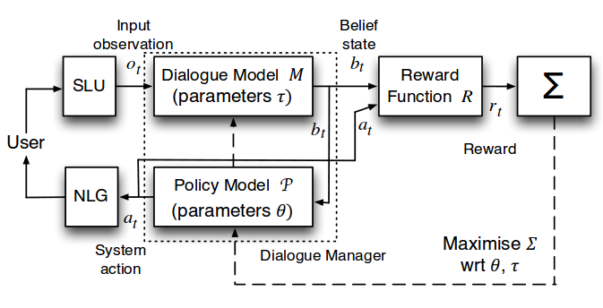

## Dialog Systems at Present

  - Most useful dialog systems currently goal-oriented and transactional
    - Dialog state as set of slots to be filled during dialog (slot-filling)
    - Conversation modeling as POMDP (Young et al., 2013).
    - Many hand-crafted features for state and action space representation

  - Hard to scale to new domains
    - Impossible to encode all features and slots users might refer to in conversation
    - Restricts their usage to narrow domains



## E2E Dialog Systems


## E2E for Goal-Oriented Conversations?

  - Usually based on NNs
  - Go from dialog history to next response
    - Intermediate task/state not available at train/test
  - Escape limitations of domain/dialog state structure
    - Should be easier to do domain adaptation
 
  - Demonstrated for "chit-chat"
    - But how well do they work on goal-oriented dialogs?

## E2E Evaluation Methods

  - Human Evaluations (AMT, etc.)
    - <span class="good">PROS</span>: test fluency, task completion, actual task
    - <span class="bad">CONS</span>: costly, not reproducible
  - Automatic (BLEU, perplexity, etc.)
    - <span class="good">PROS</span>: fast, scalable, reproducible
    - <span class="bad">CONS</span>: not correlated with human evaluation

## Restaurant booking in 5 tasks


<div align="center">

</div>


## bAbI dialog: Simulated tasks for E2E dialog systems
  - Introduces a new dataset
    - Full control of data
    - Easy diagnostics
    - No humans in the loop
    - No indirect metrics (BLEU, ROUGE, etc.)
    - Assess ability to complete goal-oriented tasks
    - Open source (https://research.fb.com/projects/babi/)

## Datasets

  - bAbI dialog sets
    - Restaurant booking domain
    - 5 simulated tasks (T1-T5)
    - 1 task converted from Dialog State Tracking Challenge 2 (T6)
  - Also proprietary concierge data
     - Users make requests through text-based chat interface handled by humans
     - All conversations between native English speakers
     - Validate bAbI as proxy for real dataset

## bAbI dialog creation

  - Knowledge base
    - Restaurants and properties: cuisine type, location, price, rating, party size, address & phone number
    - Query with API calls containing: location, type, price range & party size
  
  - Each example is dialog between user and bot, including API calls and resulting facts
    - Dialogs generated by simulation after creating user request by sampling an API call
    - NL Patterns used to generate utterances for bot and user

  - Simulation tasks mean that rule-based system can get 100%
    - Not true for T6: dev. per-response accuracy __40.7%__
    - Point is to see how/where E2E systems struggle w/o domain knowledge in narrow domain

## Task 1: Issuing API calls
  - User request with 0-4 required fields (sampled uniformly)
  - Bot must ask Qs for filling missing fields, then generate correct API call
    - Asks for information in deterministic order (makes prediction possible)
  
```
1 hello    hello what can i help you with today
2 can you book a table for six people with french food  i'm on it
3 <SILENCE>     where should it be
4 in bombay     which price range are looking for
5 i am looking for a cheap restaurant   ok let me look into some options for you
6 <SILENCE>     api_call french bombay six cheap

1 hi    hello what can i help you with today
2 can you make a restaurant reservation with italian cuisine for six people in a
cheap price range      i'm on it
3 <SILENCE>     where should it be
4 rome please   ok let me look into some options for you
5 <SILENCE>     api_call italian rome six cheap
```

## Task 2: Updating API calls

  - Start by issuing API call
    - User ask to update requests between 1-4 times
    - Order of updates is random
    - Bot asks uses if done with updates
    - Bot isues updated API call

```
1 hello    hello what can i help you with today
2 i'd like to book a table with british food in a moderate price range in bombay
for two people    i'm on it
3 <SILENCE>     ok let me look into some options for you
4 <SILENCE>     api_call british bombay two moderate
5 instead could it be in a expensive price range        sure is there anything else to update
6 instead could it be with indian cuisine       sure is there anything else to update
7 actually i would prefer for six people        sure is there anything else to update
8 instead could it be in madrid sure is there anything else to update
9 no    ok let me look into some options for you
10 <SILENCE>    api_call indian madrid six expensive
11 thanks       you're welcome
```

## Task 3: Displaying options

  - Given user request
    - Query KB using call
    - Add facts resulting from call to dialog history
    - Bot proposes options to users by listing restaurant names sorted rating desc until users accept
    - User has a 25% chance of accepting
    - If user accepts, bot should stop displaying options, otherwise keep proposing
    - User always accepts if last choice
    - Examples with API calls retrieving >= 3 options


## Task 3: Displaying options (listing)

```
1 resto_london_expensive_spanish_6stars R_phone resto_london_expensive_spanish_6stars_phone
2 resto_london_expensive_spanish_6stars R_cuisine spanish
3 resto_london_expensive_spanish_6stars R_address resto_london_expensive_spanish_6stars_address
4 resto_london_expensive_spanish_6stars R_location london
5 resto_london_expensive_spanish_6stars R_number eight
6 resto_london_expensive_spanish_6stars R_price expensive
7 resto_london_expensive_spanish_6stars R_rating 6
...
22 hi   hello what can i help you with today
23 can you make a restaurant reservation for eight people in a expensive price range in london
with spanish food    i'm on it
24 <SILENCE>    ok let me look into some options for you
25 <SILENCE>    what do you think of this option: resto_london_expensive_spanish_6stars
26 do you have something else   sure let me find an other option for you
27 <SILENCE>    what do you think of this option: resto_london_expensive_spanish_5stars
28 that looks great     great let me do the reservation

```

## Task 4: Providing extra information

 - Given user request
   - Sample a restaurant start dialog as if users agreed already to book there
   - Add all KB facts corresponding to dialog
   - Users ask for phone #, address, or both with probs 25%, 25%, 50%
   - Bot must learn to use KB facts to answer (order non-deterministic)
 
```
1 resto_bombay_cheap_french_5stars R_phone resto_bombay_cheap_french_5stars_phone
2 resto_bombay_cheap_french_5stars R_cuisine french
3 resto_bombay_cheap_french_5stars R_address resto_bombay_cheap_french_5stars_address
4 resto_bombay_cheap_french_5stars R_location bombay
5 resto_bombay_cheap_french_5stars R_number six
6 resto_bombay_cheap_french_5stars R_price cheap
7 resto_bombay_cheap_french_5stars R_rating 5
8 hi    hello what can i help you with today
9 may i have a table at resto_bombay_cheap_french_5stars    great let me do the reservation
10 may i have the phone number of the restaurant    here it is resto_bombay_cheap_french_5stars_phone
11 may i have the address of the restaurant     here it is resto_bombay_cheap_french_5stars_address
```

## Task 5: Conducting full dialogs (listing)
  - Combine tasks 1-4 to generate full dialogs
```
1 hi    hello what can i help you with today
2 i'd like to book a table for four in a expensive price range  i'm on it
3 <SILENCE>     any preference on a type of cuisine
4 with indian food      where should it be
5 in london     ok let me look into some options for you
6 <SILENCE>     api_call indian london four expensive
7 actually i would prefer in paris    sure is there anything else to update
8 actually i would prefer in a moderate price range    sure is there anything else to update
9 no    ok let me look into some options for you
10 <SILENCE>    api_call indian paris four moderate
11 resto_paris_moderate_indian_1stars R_phone resto_paris_moderate_indian_1stars_phone
12 resto_paris_moderate_indian_1stars R_cuisine indian
...
18 resto_paris_moderate_indian_8stars R_phone resto_paris_moderate_indian_8stars_phone
...
25 resto_paris_moderate_indian_5stars R_phone resto_paris_moderate_indian_5stars_phone
...
32 <SILENCE>    what do you think of this option: resto_paris_moderate_indian_8stars
33 no i don't like that sure let me find an other option for you
34 <SILENCE>    what do you think of this option: resto_paris_moderate_indian_5stars
35 let's do it  great let me do the reservation
36 may i have the phone number of the restaurant    here it is resto_paris_moderate_indian_5stars_phone
37 thank you    is there anything i can help you with
38 no thanks    you're welcome
```

## bAbI dialog evaluation

  - OOV word test
    - 2nd test set with entities (location, cusine type) not found in training set
  - Next Utterance Classification (NUC)
    - Use prediction instead of Generation
    - Select correct response from candidate list
    - Removes difficulty of evaluation of LM
  - Per-response and per-dialog accuracy
    - Per-response counts each correct response
    - Per-dialog counts task completion (all correct) (per-dialog)

## bAbI dialog stats

<div align="center">

</div>

## Evaluation of Models

  - Rule-based
  - Classical IR
    - TF-IDF
    - Nearest Neighbor
  - Embeddings
  - End-to-End Memory Networks (MemNN)

## Classical IR Methods

  - TF-IDF model
    - For each possible candidate response, compute matching score between input (last-utterance OR conversation history) & response
    - Rank by score (TF-IDF-weighted cosine sim of BoWs)
  - Nearest Neighbor Model
     - Using input (last-utterance), find most similar conversation in training and output the response from that
     - Training set is (utterance, response) pairs selected using word overlap scoring
     - When several responses for same utterance, sort decreasing co-occurrence frequency


## Supervised Embeddings Architecture
  - Use supervised word embedding models for scoring
     - (conversation history, response) pairs
     - Trained directly to predict response from conversation history
       - Candidate response y is scored against input x
       - __A__ and __B__ are embedding matrices with size __d x V__ 
      
       $$f(x, y) = (Ax)^{T} By$$
  - Train with margin ranking loss __m__ and negative response sampling
    $$f(x,y) > m + f(x, \bar{y})$$


## E2E Memory Network architecture (Sukhbaatar et. al., 2015)

  - <span class="letter-parens">(a)</span>: Single layer architecture (1 hop MemNN)
  - <span class="letter-parens">(b)</span>: Multi-layer architecture (multi-hop)

<div align="center">

</div>

## E2E Memory Network for dialog


## Match Type Features to Deal with Entities

  - Entity words have 2 important traits
    - Exact matches usually more appropriate than approximate matches
    - Frequently occur as OOV words

  - Both challenge for embedding methods
    - Embedding to a low dim space makes it hard to differentiate between exact and approx matches
    - When a new word, not seen in training, no embedding available
    
  - Match Type: Augment the vocab with 7 special words
    - One of each KB etype (Cuisne Type, Location, Price Range, Party, Rating, Phone #, Address)
    - For each type, add etype if word found 1) as a KB entity 2) in candidate 3) in input or memory
    - Allows model to learn to rely on type info using exact matching words cues when embeddings not known
    - Require access to a KB with OOV entities

## Results


## Performance by Methods (1/2)

  - Classical IR method TF-IDF is worst, way worse than Nearest Neighbor
    - Match type helps, but not enough
    - In contrast with other non-goal directed convos findings
      - Conversation moves forward more quickly sharing fewer words per __(input, response)__ pair?

  - Supervised embeddings outperform IR methods in general
    - Learned mappings between words is important.  Only 1 task is successful
    - Other tasks, some correct, but no dialog where goal achieved
    - Can provide correct response for greeting, asking to wait, making API calls and asking if other options necessary.
    - Fails to interpret results of API calls to display options, provide info or update the calls with new info

## Performance by Methods (2/2)

  - MemNNs w/o match type features perform better than IR/Embedding methods. 
    - Per-response accuracy improved, per-dialog accuracy still close to 0 on T3/T4
    - Also OOV tasks improved too, but due to better perf. on known words only
  - Optimal hyper-params on several tasks involve 3 or 4 hops
    - iterative accessing and reasoning over conversation helps

  - MemNNs with match type features give 2 perf. gains over same models w/o them
    - T4 becomes solvable because matches can be made to results of API call
    - OOV results sig. improved
    - T3 and T5 are still fail cases, perf. drops on T2, no gain on T6.
    - Matching words enough, as evidenced by poor perf. of TF-IDF matching
      - Must be combined with types and other props of MemNN model

  - Not easy to build rule systems on real problems, rule baseline beat by MemNNs on T6

## More Background
  - Bordes' NIPS 2016 slides (lots here stolen from there)
    - https://github.com/pmineiro/ldlmd2016/blob/master/abordes-discuss-nips16.pptx?raw=true
  - Open Review Page
    - https://openreview.net/forum?id=S1Bb3D5gg
  - A Survey of Available Corpora For Building
Data-Driven Dialogue Systems
    - https://arxiv.org/pdf/1512.05742.pdf
  - On the Evaluation of Dialogue Systems with Next Utterance Classification
    - http://www.aclweb.org/anthology/W/W16/W16-3634.pdf
  - Memory Networks
    - https://arxiv.org/pdf/1410.3916.pdf
  - End-To-End Memory Networks
    - https://arxiv.org/pdf/1503.08895v5.pdf
  - Building End-To-End Dialogue Systems Using Generative Hierarchical Neural Networks
    - https://arxiv.org/pdf/1507.04808.pdf
  - POMDP-based Statistical Spoken Dialogue Systems: a Review
    - http://mi.eng.cam.ac.uk/~sjy/papers/ygtw13.pdf
 